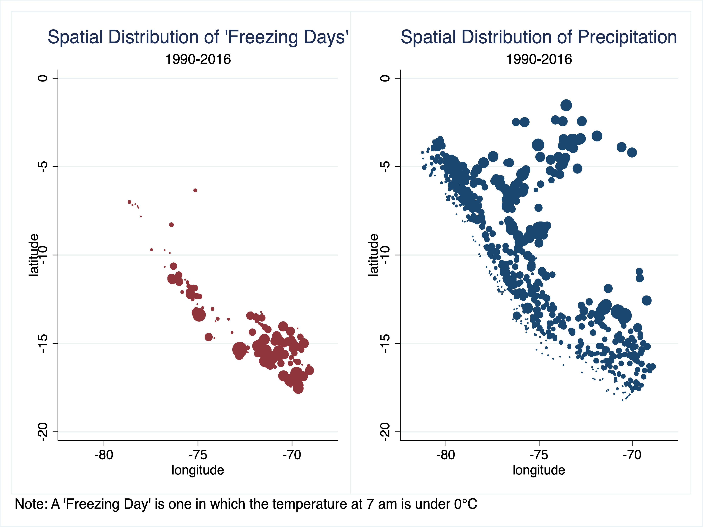

# Weather (1990 - 2016)
Author: Sebastian Sardon

These programs create a dataset of Peruvian weather data at a daily frequency.

Instructions:

&nbsp;&nbsp;&nbsp;&nbsp;&nbsp;&nbsp;Step 1. Retrieve raw data from SENHAMI's official webpage using the program "1.1 - Scrap SENHAMI.py", then preprocess it with "1.2 - Clean Scrapped.py" [requires Python 3] 
    
&nbsp;&nbsp;&nbsp;&nbsp;&nbsp;&nbsp;Step 2. Clean raw data using the program "2 - Weather Dataset.do" [requires Stata]

Step 1's output can be downloaded [here](https://www.dropbox.com/sh/z9igeu8g1tu37fx/AADkyefvuqyjRrrDhGPVh2LXa?dl=0).

Information available from the authors at sebastiansardonbisso@gmail.com. Suggestions are welcome.

The following figures can be replicated using the output dataset:

